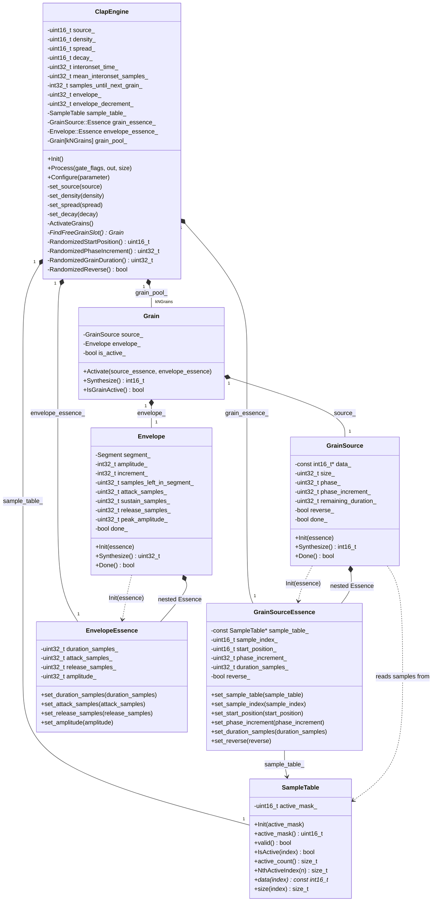
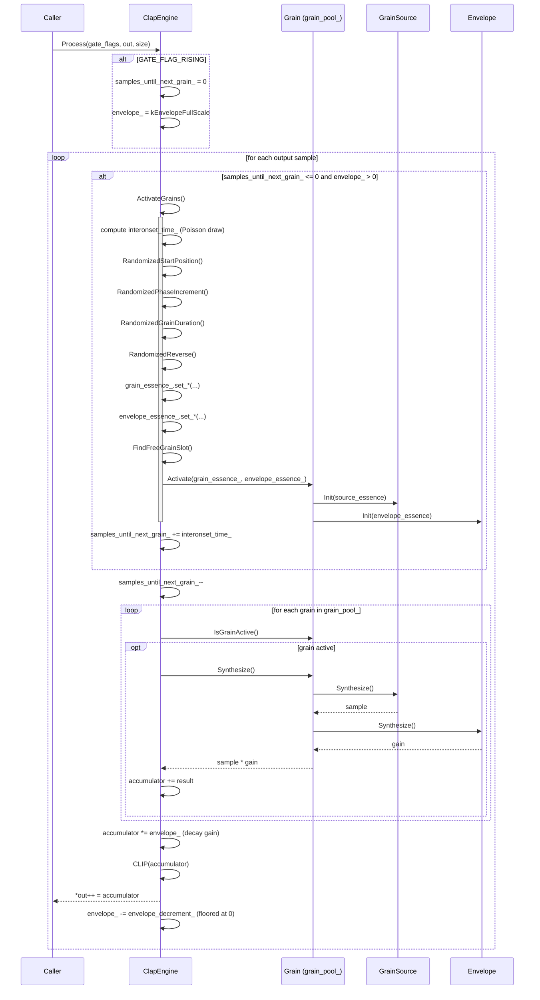

```mermaid
classDiagram
    class ClapEngine {
        -uint16_t source_
        -uint16_t density_
        -uint16_t spread_
        -uint16_t decay_
        -uint32_t interonset_time_
        -uint32_t mean_interonset_samples_
        -int32_t samples_until_next_grain_
        -uint32_t envelope_
        -uint32_t envelope_decrement_
        -SampleTable sample_table_
        -GrainSource::Essence grain_essence_
        -Envelope::Essence envelope_essence_
        -Grain[kNGrains] grain_pool_
        +Init()
        +Process(gate_flags, out, size)
        +Configure(parameter)
        -set_source(source)
        -set_density(density)
        -set_spread(spread)
        -set_decay(decay)
        -ActivateGrains()
        -FindFreeGrainSlot() Grain*
        -RandomizedStartPosition() uint16_t
        -RandomizedPhaseIncrement() uint32_t
        -RandomizedGrainDuration() uint32_t
        -RandomizedReverse() bool
    }

    class Grain {
        -GrainSource source_
        -Envelope envelope_
        -bool is_active_
        +Activate(source_essence, envelope_essence)
        +Synthesize() int16_t
        +IsGrainActive() bool
    }

    class GrainSource {
        -const int16_t* data_
        -uint32_t size_
        -uint32_t phase_
        -uint32_t phase_increment_
        -uint32_t remaining_duration_
        -bool reverse_
        -bool done_
        +Init(essence)
        +Synthesize() int16_t
        +Done() bool
    }

    class GrainSourceEssence {
        -const SampleTable* sample_table_
        -uint16_t sample_index_
        -uint16_t start_position_
        -uint32_t phase_increment_
        -uint32_t duration_samples_
        -bool reverse_
        +set_sample_table(sample_table)
        +set_sample_index(sample_index)
        +set_start_position(start_position)
        +set_phase_increment(phase_increment)
        +set_duration_samples(duration_samples)
        +set_reverse(reverse)
    }

    class SampleTable {
        -uint16_t active_mask_
        +Init(active_mask)
        +active_mask() uint16_t
        +valid() bool
        +IsActive(index) bool
        +active_count() size_t
        +NthActiveIndex(n) size_t
        +data(index) const int16_t*
        +size(index) size_t
    }

    class Envelope {
        -Segment segment_
        -int32_t amplitude_
        -int32_t increment_
        -uint32_t samples_left_in_segment_
        -uint32_t attack_samples_
        -uint32_t sustain_samples_
        -uint32_t release_samples_
        -uint32_t peak_amplitude_
        -bool done_
        +Init(essence)
        +Synthesize() uint32_t
        +Done() bool
    }

    class EnvelopeEssence {
        -uint32_t duration_samples_
        -uint32_t attack_samples_
        -uint32_t release_samples_
        -uint32_t amplitude_
        +set_duration_samples(duration_samples)
        +set_attack_samples(attack_samples)
        +set_release_samples(release_samples)
        +set_amplitude(amplitude)
    }

    ClapEngine "1" *-- "kNGrains" Grain : grain_pool_
    ClapEngine "1" *-- "1" SampleTable : sample_table_
    ClapEngine "1" *-- "1" GrainSourceEssence : grain_essence_
    ClapEngine "1" *-- "1" EnvelopeEssence : envelope_essence_
    Grain "1" *-- "1" GrainSource : source_
    Grain "1" *-- "1" Envelope : envelope_
    GrainSource ..> GrainSourceEssence : Init(essence)
    Envelope ..> EnvelopeEssence : Init(essence)
    GrainSourceEssence --> SampleTable : sample_table_
    GrainSource ..> SampleTable : reads samples from
    GrainSourceEssence --* GrainSource : nested Essence
    EnvelopeEssence --* Envelope : nested Essence
```

```mermaid
sequenceDiagram
    participant Caller
    participant ClapEngine
    participant Grain as Grain (grain_pool_)
    participant GrainSource
    participant Envelope

    Caller->>ClapEngine: Process(gate_flags, out, size)

    alt GATE_FLAG_RISING
        ClapEngine->>ClapEngine: samples_until_next_grain_ = 0
        ClapEngine->>ClapEngine: envelope_ = kEnvelopeFullScale
    end

    loop for each output sample
        alt samples_until_next_grain_ <= 0 and envelope_ > 0
            ClapEngine->>ClapEngine: ActivateGrains()
            activate ClapEngine
            ClapEngine->>ClapEngine: compute interonset_time_ (Poisson draw)
            ClapEngine->>ClapEngine: RandomizedStartPosition()
            ClapEngine->>ClapEngine: RandomizedPhaseIncrement()
            ClapEngine->>ClapEngine: RandomizedGrainDuration()
            ClapEngine->>ClapEngine: RandomizedReverse()
            ClapEngine->>ClapEngine: grain_essence_.set_*(...)
            ClapEngine->>ClapEngine: envelope_essence_.set_*(...)
            ClapEngine->>ClapEngine: FindFreeGrainSlot()
            ClapEngine->>Grain: Activate(grain_essence_, envelope_essence_)
            Grain->>GrainSource: Init(source_essence)
            Grain->>Envelope: Init(envelope_essence)
            deactivate ClapEngine
            ClapEngine->>ClapEngine: samples_until_next_grain_ += interonset_time_
        end
        ClapEngine->>ClapEngine: samples_until_next_grain_--

        loop for each grain in grain_pool_
            ClapEngine->>Grain: IsGrainActive()
            opt grain active
                ClapEngine->>Grain: Synthesize()
                Grain->>GrainSource: Synthesize()
                GrainSource-->>Grain: sample
                Grain->>Envelope: Synthesize()
                Envelope-->>Grain: gain
                Grain-->>ClapEngine: sample * gain
                ClapEngine->>ClapEngine: accumulator += result
            end
        end

        ClapEngine->>ClapEngine: accumulator *= envelope_ (decay gain)
        ClapEngine->>ClapEngine: CLIP(accumulator)
        ClapEngine-->>Caller: *out++ = accumulator
        ClapEngine->>ClapEngine: envelope_ -= envelope_decrement_ (floored at 0)
    end
```
